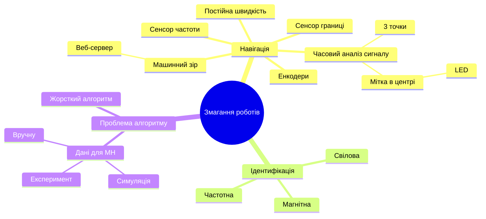

```mermaid
mindmap
  root((Змагання роботів))
    Навігація
        Машинний зір
            Веб-сервер
        Часовий аналіз сигналу
            Мітка в центрі
                LED
            3 точки
        Постійна швидкість
        Енкодери
        Сенсор границі
        Сенсор частоти
    Ідентифікація
        Свілова
        Магнітна
        Частотна
    Проблема алгоритму
        Жорсткий алгоритм
        Дані для МН
            Експеримент
            Вручну
            Симуляція
```
